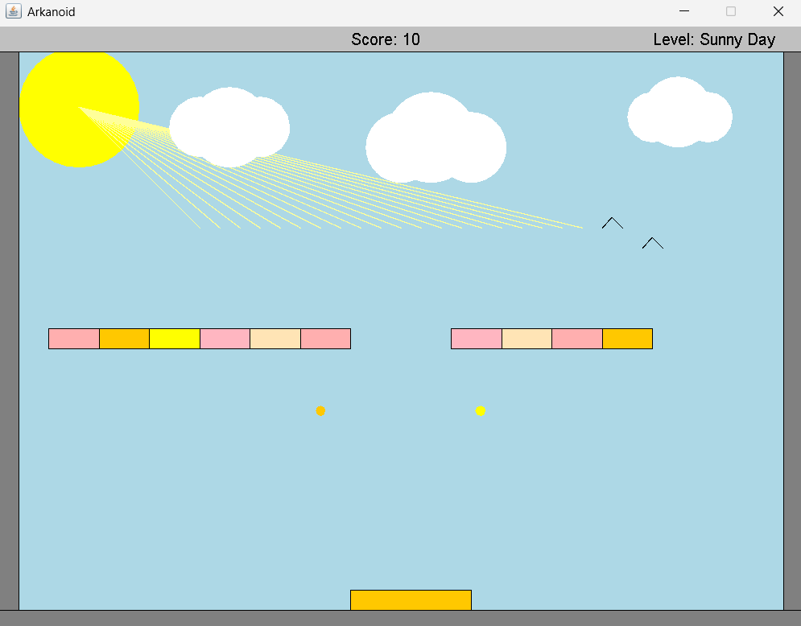
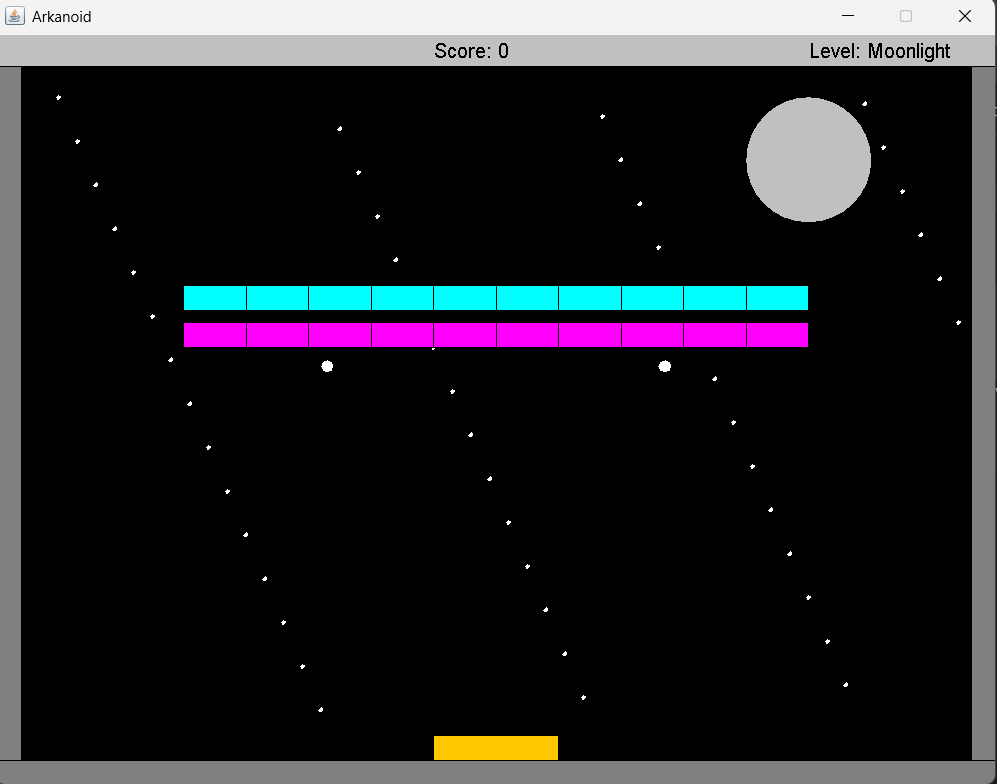
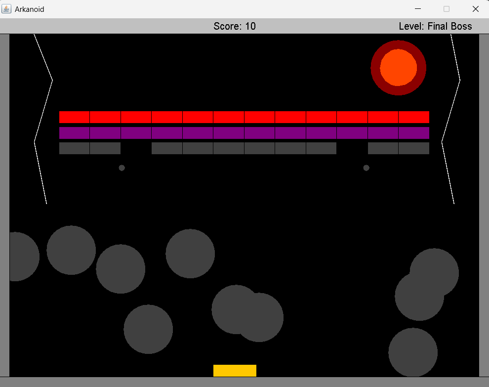

# Arkanoid Game OOP 
## Project Overview
This project is an advanced implementation of the classic **Arkanoid** game in **Java**, designed with **Object-Oriented Programming (OOP)** principles.  
The game features multiple creative levels, dynamic mechanics, and ends with a challenging **Final Boss stage**.  
The purpose of the project was to practice modular design, design patterns, and best practices in software engineering while developing a fun interactive game.

---

## Features 
- **Game Mechanics**: Paddle movement, ball control, brick collision detection, scoring system, and multiple balls support.  
- **Levels**: Includes several stages such as *Sunny Day*, *Moonlight*, and a final **Boss Fight**.  
- **Graphics**: Simple, colorful GUI designed with `java.awt` and `javax.swing`.  
- **OOP Principles**: Abstraction, Inheritance, Polymorphism, Interfaces, and use of patterns like Observer.  
- **Extensibility**: Code structured for reusability – easy to add new levels or modify mechanics.  

---

## Screenshots 

### Level 1 – Sunny Day 

### Level 2 – Moonlight 

### Final Boss 

---

## How to Run 
1. Clone the repository to your local machine.
2. Open the project in your preferred IDE (e.g., IntelliJ, Eclipse)
3. Compile and run the main class (Game.java)
4. Enjoy breaking bricks and defeating the boss!

---

## Technologies Used
Java – Core programming language.

OOP Principles – Abstraction, Inheritance, Polymorphism, Interfaces, Design Patterns.

GUI – Implemented using Java’s built-in AWT and Swing libraries
